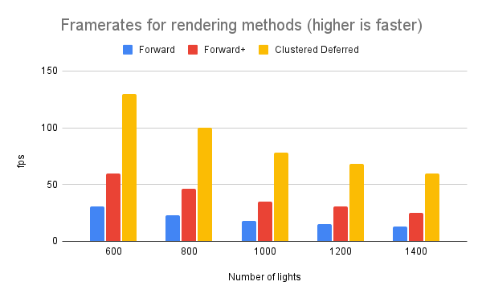
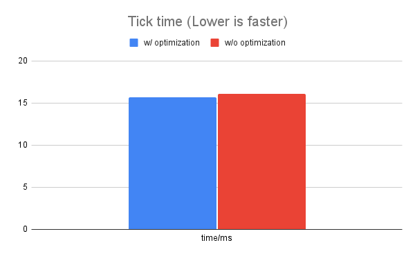
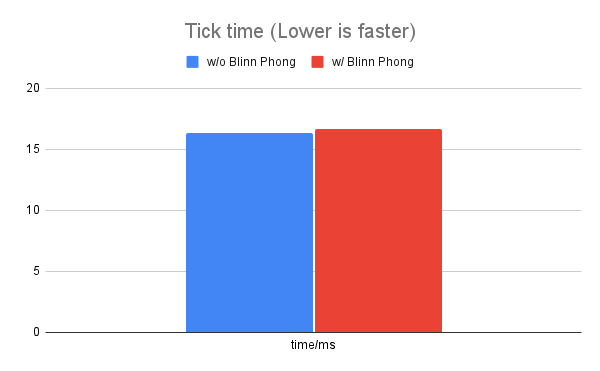

WebGL Forward+ and Clustered Deferred Shading
======================

**University of Pennsylvania, CIS 565: GPU Programming and Architecture, Project 5**

* Jiyu Huang
* Tested on: **Google Chrome 95.0.4638.54** on
  Windows 10, AMD Ryzen 7 5800H @ 3.20GHz 16GB, RTX 3070 Laptop 8GB

### Live Online

http://JiyuHuang.github.io/Project5-WebGL-Forward-Plus-and-Clustered-Deferred

### Demo Video/GIF

# Performance Analysis

This section compares the performance of forward+ and clustered deferred rendering with single-pass forward rendering. Ideally, performance would be analyzed using the tick time. However, the tick time for forward rendering isn't recorded properly somehow, so for now I'm resorting to using framerate as a performance metric. The following performance analysis is conducted without throttling CPU.

As seen from the graph, forward+ significantly improves the performance of forward rendering, as the number of light accumulations in the fragment shaders gets reduced from the number of lights in the scene to the number of lights in the cluster. Clustered deferred rendering's performance is even significantly better than forward+'s, since it decouples the lighting stage from the objects.

# Implementation Details

## Updating Light Clusters

In forward+ and clustered deferred rendering, we divide the view frustum into various sub-frustums along the camera space x, y and z axis. For each sub-frustum, we identify a cluster of lights that potentially affect objects in the sub-frustum. Then in the lighting process, only lights in the cluster need to be considered, thus reducing workload when the amount of lights is large and improving performance.

A naive implmentation would be to check every sub-frustum for every light for intersection. We can improve on this algorithm and instead, for every light, compute the index ranges of potential sub-frustums it intersects along the x, y and z axis.

To achieve this, first we transform the light position into camera space, and then use the camera-space axis-aligned bounding box to check sub-frustum index ranges. Since each sub-frustum isn't a cuboid but rather a trapezoidal prism, we need to check both the near plane and the far plane for sub-frustm index ranges along the camera-space x and y axis.

## G-Buffer Optimization

In clustered deferred rendering, we store objects' position, normal, and albedo information in the G-buffer in the first pass, and then render the scene using the G-buffer. To optimize G-buffer usage, I used oct encoding to transform surface normals into two floats. This meant that I could now pack all the information into 2 vec4s intead of the original 3.

Performance wise this only marginally improved performance, as shown in the graph below. The performance analysis were made with 800 lights, checking the tick time by using chrome's profiling tool and throttling CPU by 6x slowdown.

## Blinn Phong Reflection Model

The Blinn Phong reflection model is implemented in addition to the standard Lambertian diffuse model. With 800 lights, this marginally decreased the performance of forward+ rendering from average tick time of 16.7 ms to 16.3 ms without CPU throttling. The execution of Blinn Phong specular highlight computation only involves a few additional computations, so this is expected.

## Post-Processing Bloom

A "bloom" post processing shader is implemented (for clustered deferred rendering only). To achieve true bloom effect, HDR color values are needed. The current version only supports LDR, so the bloom effect won't look ideal. Therefore, by default bloom is turned off. To turn it on, in src/main.js, comment out line 19 and uncomment line 20. At 800 lights with no CPU throttling, this increases tick time from 8ms to 9ms (reduces fps from 120 to 110). Since bloom requires a separate render pass and samples the color of near by pixels, it makes sense that it is more performance demanding.

### Credits

* [Oct-encoding surface normals](http://jcgt.org/published/0003/02/01/paper.pdf)
* [Three.js](https://github.com/mrdoob/three.js) by [@mrdoob](https://github.com/mrdoob) and contributors
* [stats.js](https://github.com/mrdoob/stats.js) by [@mrdoob](https://github.com/mrdoob) and contributors
* [webgl-debug](https://github.com/KhronosGroup/WebGLDeveloperTools) by Khronos Group Inc.
* [glMatrix](https://github.com/toji/gl-matrix) by [@toji](https://github.com/toji) and contributors
* [minimal-gltf-loader](https://github.com/shrekshao/minimal-gltf-loader) by [@shrekshao](https://github.com/shrekshao)
